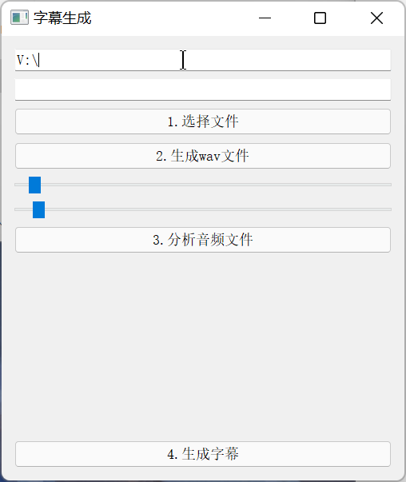

# AutoVideoSrt

使用pydub与 fastasr将音频转换为srt字幕文件

使用时请安装上述两个python库，如何安装详见他们的库说明

此外还需要下载paraformer_cli模型

### 使用说明

这是程序界面

第一行 V:\ 请修改为你自己的临时文件存储路径

请将ffmpeg添加在PATH路径，重启生效，或者使用临时添加命令（懂的都懂

#### 开始使用

0.设置模型存储位置

1.选择文件 选择需要转字幕的文件mp4 mp3 等ffmpeg支持的音频视频文件

2点击生成wav文件 有时会在命令行界面提示文件覆盖，按提示输入即可

3.分析音频文件 尽量将分段控制在没有10s以上与0.2s以下的分段数量

4.如果python库与cuda、cudnn安装没有错误 在等待一段时间后会在临时文件存储目录建立一个字幕文件
